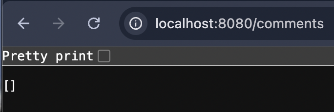
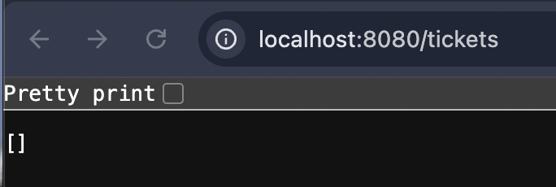
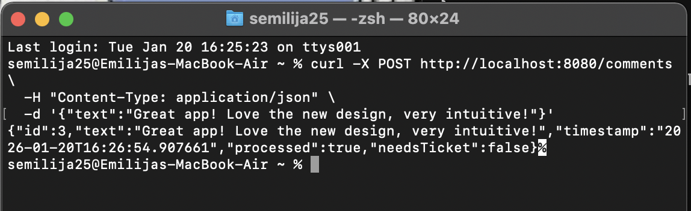
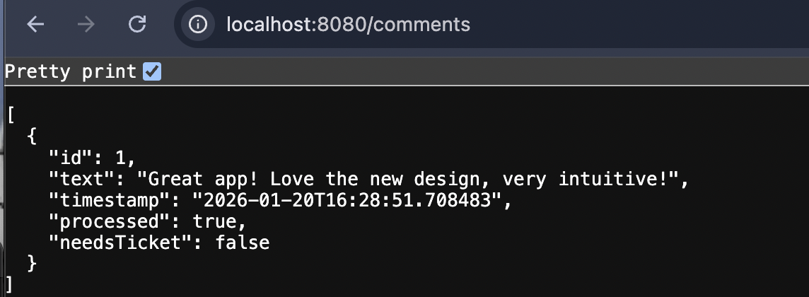
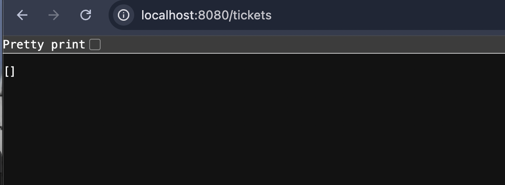
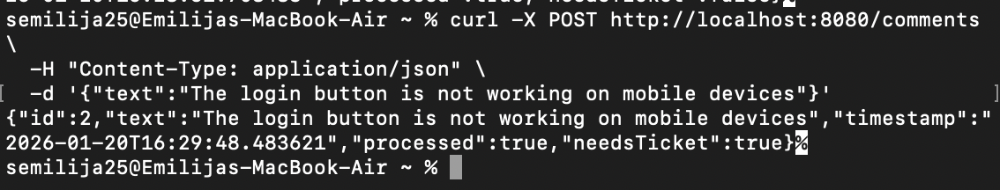
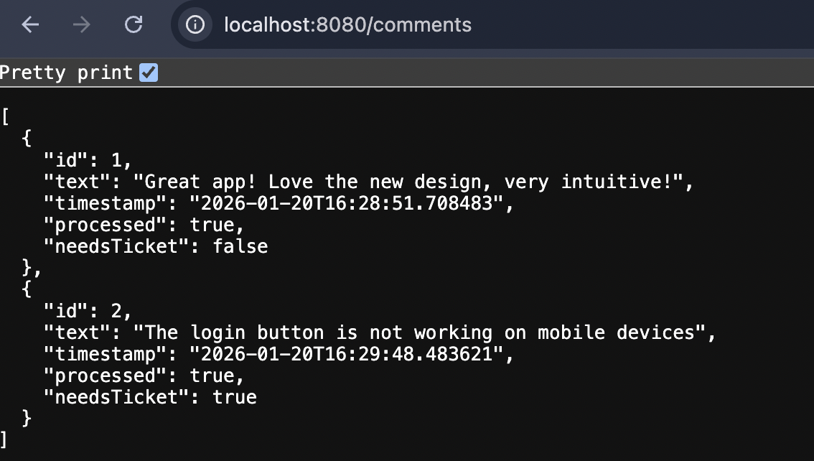
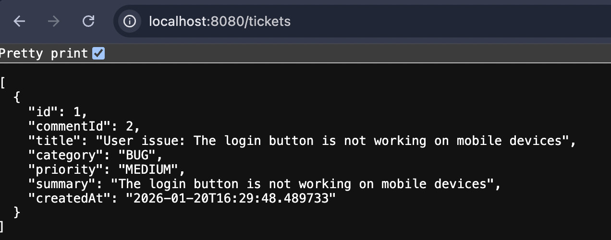
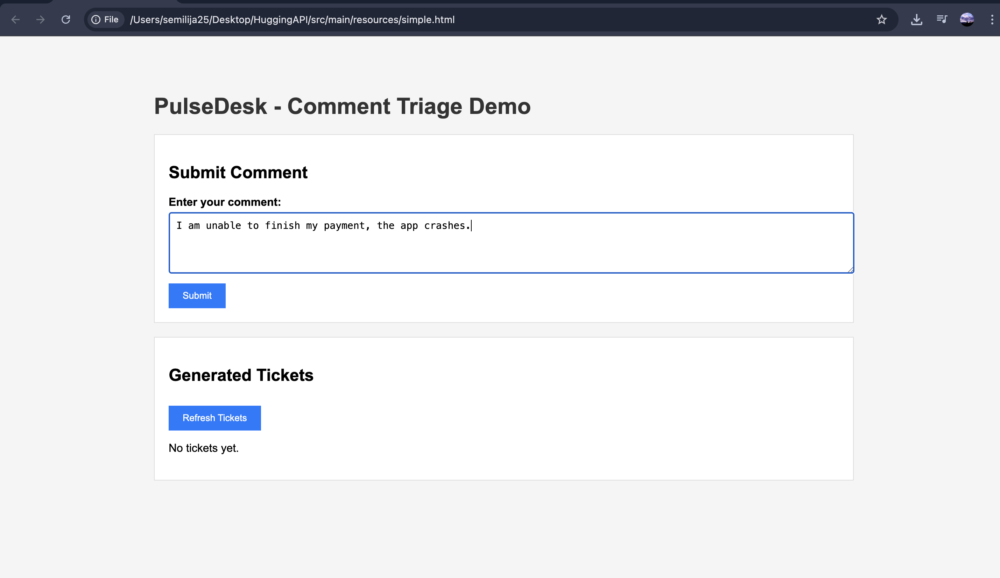
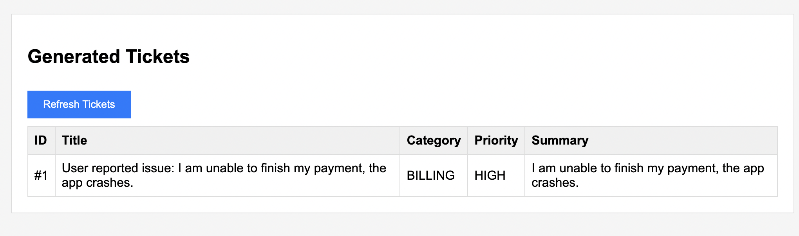

## Pulse Desk - Comment to ticket system.

## Link to deployen application: https://pulse-desk-1.onrender.com/simple.html

## Video demonstration:
https://www.youtube.com/watch?v=y7rjymqp-XY

# Table of Contents
- [Main Idea](#main-idea)
- [Features](#features-)
- [Project Structure](#project-structure)
- [Getting Started](#getting-started)
- [Quick Test](#quick-test)
- [How It Works](#how-it-works-visual-guide)
- [API Endpoints](#api-endpoints)
- [Future Improvements](#future-improvements)


## Main idea: 
**PulseDesk** is an intelligent backend system that **automatically analyzes 
user feedback using AI** and creates support tickets only when necessary. It **helps support teams focus on real issues** by filtering out positive feedback and automatically categorizing problems.

# Problems: 
1. **Important issues can be missed.**
2. People have to read all feedbacks in order to find bad ones.
3. No standardized categorization.

# Solutions:
1. **Automatically detect** if a comment requires support.
2. **Create tickets** only for actual problems.
3. **Categorize issues** (Bug, Feature, Billing....).
4. **Assign priority levels** (High, Medium, Low).
5. **Filter out** compliments and positive feedback.

# Features: 
- **AI-Powered Analysis** - Intelligent comment classification.
- **Automatic Ticket Creation** - Only for issues requiring support.
- **Smart Categorization** - 5 categories (Bug, Feature, Billing, Account, Other).
- **Priority Assignment** - Automatic priority levels.
- **RESTful API** - Easy integration with any frontend.
- **H2 Database** - In-memory storage for quick development.
- **Web UI** - Simple interface for testing.


## Project structure:
````
src/main/java/com/example/huggingapi/
├── Controller/
│   ├── CommentController.java      # REST endpoints for comments
│   └── TicketController.java       # REST endpoints for tickets
├── Logic/
│   ├── CommentService.java         # Comment processing logic
│   ├── TicketService.java          # Ticket creation logic
│   └── HuggingFaceService.java     # AI integration & fallback
├── Model/
│   ├── Comment.java                # Comment entity
│   ├── Ticket.java                 # Ticket entity
│   └── AnalysisResultFromAI.java   # AI response DTO
├── Repository/
│   ├── CommentRepository.java      # Comment data access
│   └── TicketRepository.java       # Ticket data access
└── HuggingApiApplication.java      # Main application class

src/main/resources/
├── application.properties          # Configuration
└── static/
    └── simple.html                 # Web UI
````

## Getting started
Before you begin, ensure you have:

- Java 17 or higher
- Maven 3.6+
- Git
1. **Clone the repository**
   ````
   git clone https://github.com/brumeras/Pulse-Desk

   cd HuggingAPI
   ````

2. **Verify Java & Maven**
   ````
   1. Check Java version
   java -version
   
   # Should show: openjdk version "17.x.x"
   
   2. Check Maven version
   mvn -version
   
   # Should show: Apache Maven 3.6.x or higher
   ````
   
3. **Configure HuggingFace API Token**

   **IMPORTANT:** The application requires a HuggingFace API token to work.
   ````
   3.1. Get Your HuggingFace Token
   
   Go to huggingface.co and sign up (free)
   
   Navigate to Settings → Access Tokens
   
   Click "New token"
   
   Name it: pulsedesk-api
   
   Select "Read" permission
   
   Click "Generate"
   
   Copy the token (starts with hf_...)
   ````
   ````
   3.2 Add Token to Configuration
   
   Open src/main/resources/application.properties and update:
   
   # Replace YOUR_TOKEN_HERE with your actual HuggingFace token
   huggingface.api.token=YOUR_TOKEN_HERE
   ````
4. **Build the Project** 
   
   ````
   This will download all dependencies and compile the code:
   ./mvnw clean compile
   ````
   ````
   Expected output:
   [INFO] BUILD SUCCESS
   [INFO] Total time: 30 s
   If build fails:
   
   Check Java version: java -version
   Check Maven version: mvn -version
   Check internet connection (Maven downloads dependencies)
   ````

5. **Run the Application**
   ``
   mvn spring-boot:run
   ``
6. **Verify It's Running**
   Open in browser:
   ````
   http://localhost:8080/tickets

   http://localhost:8080/comments
   ````
7. Then open a file in src/main/simple.html
This is the UI for the application in which a user can submit the comments. 

# Quick Test

1. **Submit a test comment:**
````
curl -X POST http://localhost:8080/comments \
-H "Content-Type: application/json" \
-d '{"text": "The app crashes when I try to login!"}'
````

2. **Expected response:**
````
   {
   "id": 1,
   "text": "The app crashes when I try to login!",
   "timestamp": "2026-01-21T17:00:00",
   "processed": true,
   "needsTicket": true
   }
````
3. **Check if ticket was created:**
````
   curl http://localhost:8080/tickets
````
4. **Expected responce**
````
[
  {
    "id": 1,
    "commentId": 1,
    "title": "Application crashes during login",
    "category": "BUG",
    "priority": "HIGH",
    "summary": "User reports app crash when attempting to login",
    "createdAt": "2026-01-21T17:00:00"
  }
]
````
## How it works (Visual Guide)

1. **Firstly, the program is being started.**
Before everything http://localhost:8080/tickets and http://localhost:8080/comments
are empty:


   


   

2. **Example: a positive comment is being left.**
   
   For example, a good comment is being left by a happy user:


   


   The comment is saved:

   
   
   However, AI analyzes and determines NO ticket needed:

   

   Why? The AI detected positive sentiment - no support required! 

3. **Example: a bad comment is left.**
   For example, user reports an issue:


   


   Comment is saved:

   

   AI analyzes and automatically creates ticket:

   

   Result: Support team can immediately see and address the issue!

# Using a website:
Billing Issue via Web UI

**Step 1:** User submits payment problem through web interface:


**Step 2:** HIGH priority BILLING ticket automatically created:


````
AI Classification:

Category: BILLING
Priority: HIGH (payment issues are urgent!)
Title: Auto-generated descriptive title
Summary: AI-generated issue summary
````
# API Endpoints

### Comments

| Method | Endpoint | Description |
|--------|----------|-------------|
| POST | `/comments` | Submit a new comment |
| GET | `/comments` | Get all comments |
| GET | `/comments/{id}` | Get comment by ID |

### Tickets

| Method | Endpoint | Description |
|--------|----------|-------------|
| GET | `/tickets` | Get all tickets |
| GET | `/tickets/{id}` | Get ticket by ID |

# Future Improvements

- **Email notifications** for new tickets
- **Ticket status tracking** (Open/In Progress/Closed)
- **Multi-language** support
- **Comment attachments** (images, files)

**Fun fact:** This entire project was built because someone left a comment: *"Why do we have to read all these comments manually?"*

**So if you're reading this... congratulations! 
You're part of the problem AND the solution! 🎉**

[⬆ Back to Top](#pulse-desk---comment-to-ticket-system)