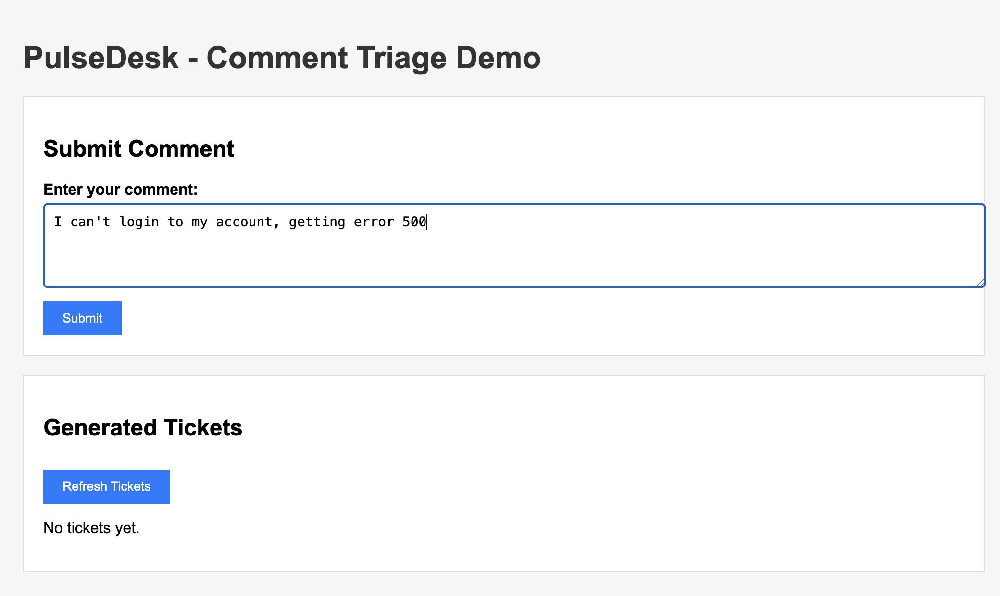
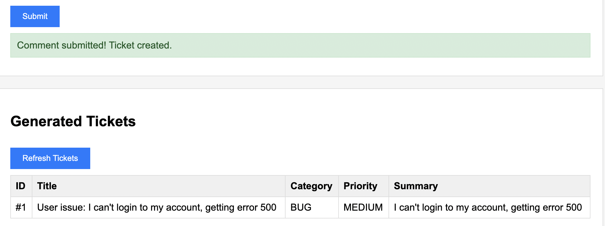
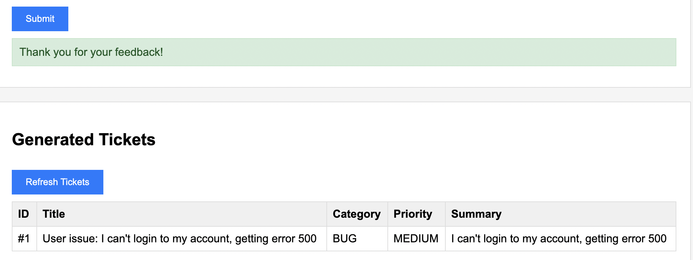

## Pulse Desk - Comment to ticket system.

## Main idea: 
PulseDesk is a backend system, which analyses users feedback (comments) by integrated AI
(Hugging Face) and creates a ticket if comment was left in order for product to improve. 

## Video demonstration:

## Project structure:
````
├── Controller/
│   ├── CommentController.java      # for REST endpoints comments
│   └── TicketController.java       # for REST endpoints tickets
├── Service/
│   ├── CommentService.java         # comment's logic 
│   ├── TicketService.java          # ticket's logic
│   └── HuggingFaceService.java     # AI integration
├── model/
│   ├── Comment.java                # comment's model
│   ├── Ticket.java                 # ticket's model
│   └── AIAnalysisResult.java       # AI answers DTO
├── repository/
│   ├── CommentRepository.java      # Data storage
│   └── TicketRepository.java
└── PulseDeskApplication.java       # Main class 
````

## How it works (screenshots)

1. Firstly, the program is being ran on preferred IDE.
Before everything http://localhost:8080/tickets and http://localhost:8080/comments
are empty:
   

   

2. Example: a good comment is being left. 
   
   For example, a good comment is being left by a happy user:
   
   
   The comment is being saved:
   
   
   However! The ticket is not being created! Because AI analysed it 
   and decided the user does not need help:
   

3. Example: a bad comment is being left.
   For example, a bad comment is being left by a dissapointed user:
   

   The comment is being saved:
   

   And most importantly a ticket is being created after AI analyses it, so,
   staff can recognise the issue.
   

## Using a website: 

# Leaving a bad comment: 


# Few moments later a ticket is created: 


# Good Comment (when it is sent a ticket is NOT created):


## AI categories and priorities


````
Categories:
BUG - technical issues
FEATURE - request on new features
BILLING - issues with payment 
ACCOUNT - issues with an account
OTHER - other problems

Priorities:
HIGH - critical and urgent problem
MEDIUM - medium priority
LOW - low priority
````

